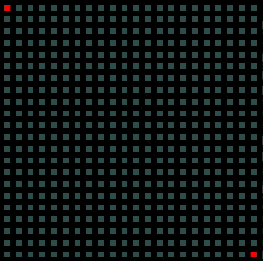

# A maze: maze algorithm visualisation in Python

A toy project to teach myself Python. This uses Pygame to render mazes
 and Tkinter for the control panel.

You can see nice gifs of the supported generators/solvers below. The gifs
are slowed down, the algorithms perform well even on big mazes. There
are several options to control execution speed directly from the control
panel (slow down/speed up execution).

Only tested under Ubuntu 18.04. You need pygame, Pypy's bitarray module,
tkinter, and Python >= 3.6:
```bash
sudo apt-get install python3-tk
cat DEPENDENCIES | xargs pip3 install
```

Running in Bash:

```bash
PYTHONPATH="$(pwd)/src" python3 -m amaze
```


## Maze generators

#### DFS


#### Eller

<details>
    <summary>Gif...</summary>


</details>

#### Kruskal

<details>
    <summary>Gif...</summary>


</details>

#### Prim

<details>
    <summary>Gif...</summary>


</details>

#### Recursive division

<details>
    <summary>Gif...</summary>


</details>


#### Sidewinder

<details>
    <summary>Gif...</summary>


</details>

#### Wilson

<details>
    <summary>Gif...</summary>



</details>


## Maze solvers

#### A*


#### DFS

<details>
    <summary>Gif...</summary>


</details>

#### BFS

<details>
    <summary>Gif...</summary>


</details>

#### Dead-end filling

<details>
    <summary>Gif...</summary>


</details>

#### Left-/right-hand rule

<details>
    <summary>Gif...</summary>

 

</details>

